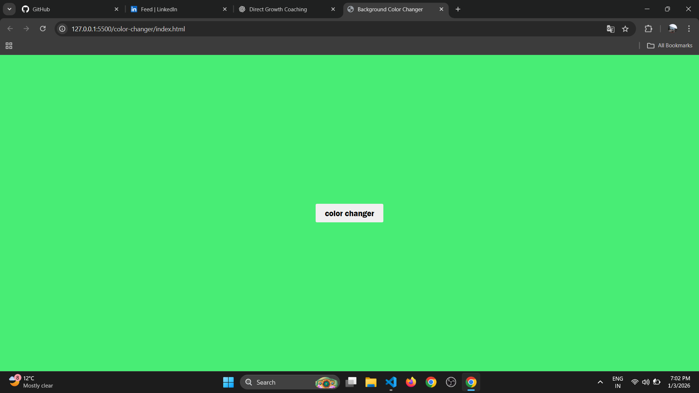

# Background Color Changer

A simple JavaScript project that changes the background color of the page on button click.

## Features
- Change background color dynamically
- Random color generation
- Instant visual feedback
- Simple and clean UI

## Tech Stack
- HTML
- CSS
- JavaScript (Vanilla)

## Screenshot

## How to Run
1. Clone the repository
2. Open `index.html` in your browser
3. Click the button to change background color

## How It Works
- A button click triggers a JavaScript function
- The function generates a random color
- The background color of the page is updated using DOM manipulation

## What I Learned
- Handling click events in JavaScript
- Dynamically updating styles using JavaScript
- Writing simple logic without overcomplicating the solution
- Completing and documenting a project properly

## Future Improvements
- Display the current color code (HEX / RGB)
- Add smooth transition animation
- Add copy-to-clipboard feature for color code

## Author
Romi Mawandia
