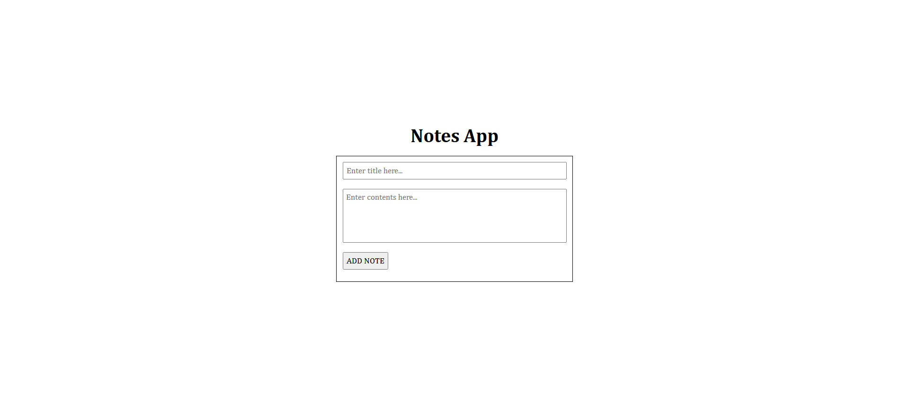

# Notes App 📝

A simple Notes App built using **JavaScript** that allows users to add and remove notes.  
The app uses **LocalStorage** to store notes so that data persists even after refreshing the page.

This project focuses more on **core functionality and logic** rather than perfect UI design.

---

## Features

- ➕ Add new notes  
- ❌ Remove existing notes  
- 💾 Data stored using **LocalStorage**  
- 🔄 Notes remain saved after page refresh  
- 🎨 Simple and imperfect UI (logic-focused project)

---

## Tech Stack

- HTML  
- CSS  
- JavaScript (Vanilla JS)  
- LocalStorage API  

---

## How It Works

- When a note is added, it is saved in the browser's LocalStorage.
- On page load, notes are fetched from LocalStorage and displayed.
- When a note is removed, it is also deleted from LocalStorage.

---

## Limitations

- UI is basic and not fully optimized.
- No edit feature (only add and delete).
- No backend (client-side only).

---

## Purpose of This Project

This project was created to:
- Practice JavaScript fundamentals  
- Understand **LocalStorage**  
- Improve logical thinking and DOM manipulation  
- Focus on functionality over design perfection  

---

## Future Improvements

- Edit notes feature  
- Better UI/UX  
- Search functionality  
- Categories or tags for notes  

---

## Author

Created by **Romi**  
Learning-focused project 🚀

## Screenshot
