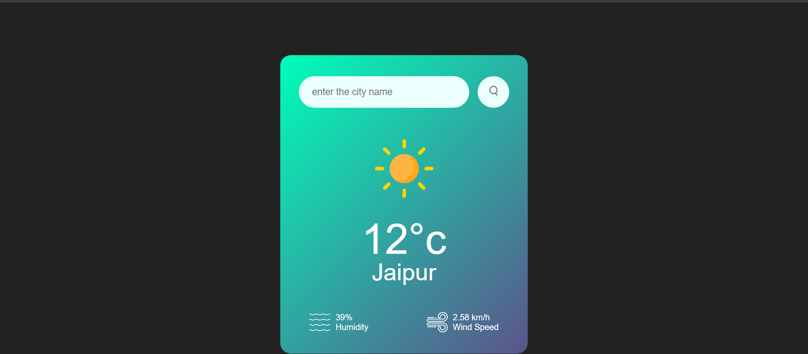

# 🌦️ Weather App

A simple Weather App built using **HTML, CSS, and JavaScript**.  
This app fetches real-time weather data using an external API and displays current weather details for any city.

---

## 🚀 Features

- 🌍 Search weather by city name
- 🌡️ Shows temperature, humidity, and wind speed
- ☁️ Displays weather condition (Clear, Clouds, Rain, etc.)
- ⚡ Uses live API data
- 📱 Simple and responsive UI

---

## 🛠️ Technologies Used

- HTML
- CSS
- JavaScript
- Weather API

---

## 📸 Screenshot

```md


## 🔑 How It Works

-User enters a city name
-JavaScript calls the Weather API using fetch()
-API returns weather data
-Data is displayed on the UI

weather-app/
│
├── index.html
├── style.css
├── script.js
└── README.md

## ⚙️ How to Run the Project

1. Clone the repository
   `git clone <your-repo-link>`
2. Open index.html in your browser
3. Enter a city name and check the weather 🌤️

## 📌 Learning Outcome

- Learned how to use fetch() API
- Understood API integration in JavaScript
- Improved DOM manipulation skills
```
